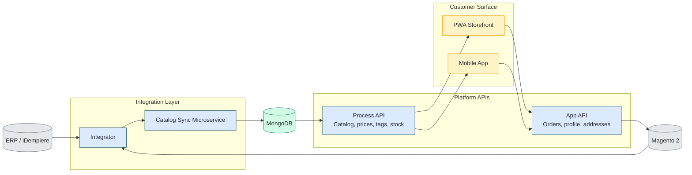

## TL;DR

- A Node.js + Angular e-commerce project at a regional supermarket chain had reached pre-launch with no reliable deploy path.
- I joined as the second engineer on a two-person team, finished the platform, and shipped it as a **PWA + mobile apps to a high-volume customer base**.
- Along the way we built the **Docker image registry and CI/CD pipeline** that made continuous delivery possible — for this project and the ones that followed.

## Context

A regional supermarket chain in Venezuela had an e-commerce initiative in flight when I joined: there was a Node.js backend, an Angular frontend, and a customer base waiting for it. What was missing was the path from "code in a repo" to "an app customers actually use."

The shape of the work is one any engineer who has joined a pre-launch greenfield will recognise:

- A codebase that ran in development but didn't yet have a repeatable build or deploy path.
- An open question about the customer surface — PWA, native apps, or both.
- Adjacent business needs (customer segmentation, exchange-rate ingestion) waiting on someone with the bandwidth to pick them up.

The brief was simple in one sentence and hard in practice: *finish it and ship it.*

## Constraints

| Constraint | Reality |
|---|---|
| Team size | 2 engineers total, including me, embedded with the business |
| Calendar | Months, not quarters — the chain had already waited too long |
| Stack inherited | Node.js backend, Angular frontend, no deploy story |
| Customer surface | Needed to reach customers on phones, fast, without an app-store gauntlet |
| Adjacent work | Customer segmentation and exchange-rate ingestion were also on the table |

The non-negotiable: ship something customers could use, then build the platform underneath that made the next thing easy.

## Architecture at a glance

Based on the original delivery architecture (simplified from the internal diagram), this is the flow we shipped:

## Decisions

### Decision 1 — Ship a PWA first, native apps second

The fastest path to a phone screen wasn't an iOS/Android binary — it was a Progressive Web App that customers could install from a link.

| Option | Trade-off | Chose |
|---|---|---|
| Build native iOS + Android apps from day one | Months of platform-specific work; app-store review on every change | |
| Ship a PWA from the existing Angular code, wrap as mobile apps later | Web-first surface available in days, not months; one codebase to maintain | <DecisionCheck /> |

The mobile apps came after, on the foundation the PWA had already proven.

### Decision 2 — Build the deploy path before finishing the features

Tempting as it was to chase the feature backlog, the bottleneck wasn't features — it was that nothing could be deployed reliably.

| Option | Trade-off | Chose |
|---|---|---|
| Hand-deploy until launch, automate later | Faster on day one; every deploy after that costs the same hour | |
| Stand up a private Docker registry + a thin CI/CD pipeline first | Two weeks of platform work before any new feature shipped; every deploy after that was free | <DecisionCheck /> |

Same principle as similar rescue work: stabilize the runtime before chasing the roadmap. The pipeline outlived the project — the team after me kept using it for the Node.js and Angular services that came next.

### Decision 3 — Treat customer segmentation as a small, useful side-quest

Marketing wanted to know which customers to talk to and when. I ran an **RFM analysis** (Recency, Frequency, Monetary) on the order data the new platform was already collecting.

| Option | Trade-off | Chose |
|---|---|---|
| Wait until a dedicated data team exists | Months of waiting on insight the business needed now | |
| Run RFM on the existing data, hand the segments to marketing | Lightweight, immediately useful, and proved the new platform's data was worth something | <DecisionCheck /> |

It wasn't a "data platform." It was a one-engineer analysis that paid for itself the first week marketing used it.

### Decision 4 — Automate exchange-rate ingestion instead of typing it in

Pricing in Venezuela depends on the official exchange rate, which someone on the team was copy-pasting daily. Manual rate entry was both error-prone and beneath the pay grade of every person doing it.

| Option | Trade-off | Chose |
|---|---|---|
| Keep doing it manually | Free until it isn't — a single typo moves prices on a whole catalog | |
| Scrape the official rate on a schedule and push it into the platform | A small ingestion job; removes a daily chore and a class of pricing bugs | <DecisionCheck /> |

This is the seed of the BCV-scraper work I later wrote about publicly. Small automations like this one tend to pay back quickly, mostly because they remove a recurring human failure mode rather than because they save time directly.

## Outcome

By the end of the engagement:

- The platform shipped as a **PWA + mobile apps used by a high-volume customer base**.
- The company had a **private Docker registry and a working CI/CD pipeline** for Node.js and Angular services — the foundation for everything that came after.
- Marketing had **RFM-based customer segments** they could act on, drawn from the platform's own data.
- Pricing ran on an **automated exchange-rate feed** instead of a daily copy-paste.

<!-- > ⚠️ **Author note (placeholder, please confirm):** if you have any of these handy, drop them in to replace this callout — *time-from-takeover-to-launch*, *number of releases per week after CI/CD landed*, *uptime numbers*, or *order volume in the first month*. Even rough numbers from memory beat adjectives. -->

In hindsight, the sequencing mattered more than the headcount: getting the deploy path in place before chasing the feature backlog is what made the rest of it shippable by a small team.

## What I'd do on GCP today

Same brief today, same team size, same constraints. The instincts wouldn't change; the targets would.

- **Frontend:** ship the PWA the same way, but host it on **Firebase Hosting** or **Cloudflare Pages** with a CDN edge in front. Lighthouse perf as a CI gate, not an afterthought.
- **Backend:** containerize the Node.js services for **Cloud Run**. No private registry to maintain — **Artifact Registry** comes with the platform.
- **CI/CD:** **GitHub Actions → Cloud Run**, preview environment per PR. The pipeline I hand-built in 2022 is now ten lines of YAML.
- **RFM and segmentation:** land the orders in **BigQuery** via a Cloud Run job, run the RFM query as a scheduled view, and surface the segments to marketing through **Looker Studio** instead of a CSV. Same analysis, no engineer in the loop after week one.
- **Exchange-rate ingestion:** **Cloud Scheduler → Cloud Run job → Pub/Sub → BigQuery + the storefront cache**. The scraper still runs; everything around it stops being a cron on a single VM.
- **Mobile apps:** Capacitor or PWABuilder wrapping the same PWA, signed and shipped through **Firebase App Distribution** for staged rollouts.

The shape of the work stays the same — deploy path first, customer surface next, the smaller automations after that. GCP just removes a lot of the platform plumbing that used to be the job.

---

*If you're working through something similar and want a second pair of eyes, I'm happy to talk it through — [reach out here](/contact).*
